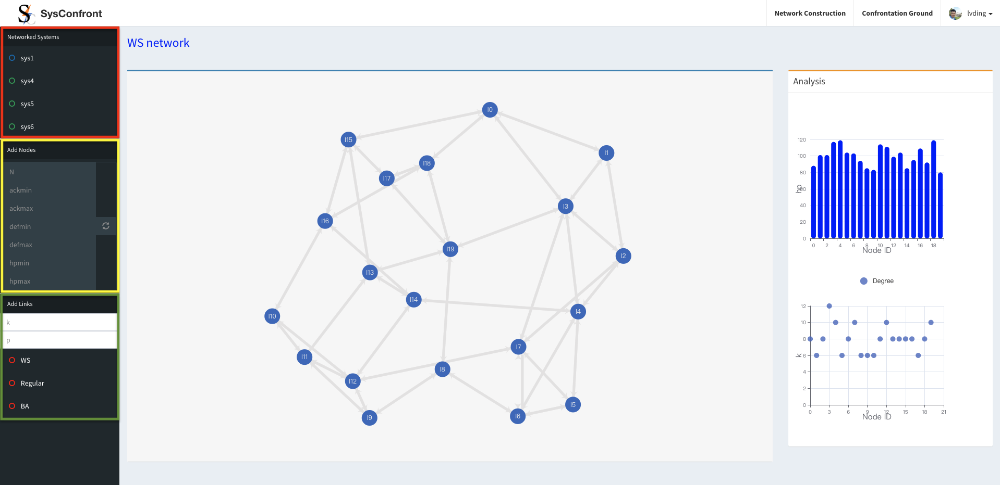
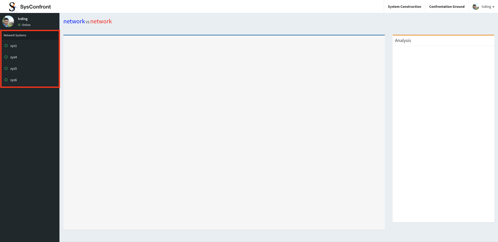
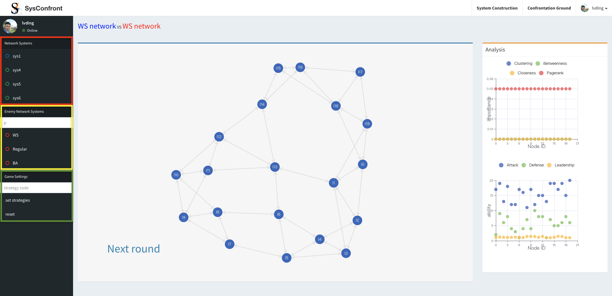
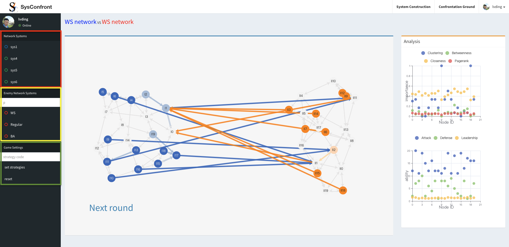

# SysConfront 文档

## 简介
SysConfront 是一个在线平台（ https://sysconfront.dinglyu.cn/ ），供用户构建自定义网络系统和可视化网络系统的对抗游戏。
SysConfront 附在论文“Ding Lyu, Hanxiao Liu, Lin Wang, and Xiaofan Wang. Confrontation Game of Networked Systems. Submitted to IEEE TNSE.” 中。
论文中提出的对抗策略都嵌入到平台中。

## Dependencies
SysConfront 是基于 Python（包括多个三方包）、Django 和 MySQL 搭建的线上平台。

## 用户手册

### 1 注册和登陆
访问 https://sysconfront.dinglyu.cn/register/ 。我们建议用户使用 xxxxxx（用户名）注册一个帐户，
xxxxxxx@qq.com（邮箱）和xxxxxx（密码）。 'xxxxxx' 由字母组成。无需通过电子邮件进行验证。

访问 https://sysconfront.dinglyu.cn/login/ （或点击“我已有账号”按钮）。 使用以下用户名和密码登录平台：

### 2 网络构建

登录平台后，用户可以访问网络对抗页面：

用户可以通过添加或删除网络来管理他们的网络化系统，如红框所示。
带有蓝色顶线的主面板显示了两个具有不同颜色（蓝色和橙色）的网络。
带有绿色顶线的右侧面板展示了网络的基本信息，包括网络模型、节点数和边。
用户点击红框内标题为超链接的绿色圆圈，即可建立和更新网络。

网络构建分为两步：添加节点和添加连边。
首先，用户可以生成具有三个内在属性（攻击、防御和健康）的多个 (N) 个节点。
当用户提交 N、ackmin、ackmax、defmin、defmax、hpmin 和 hpmax 时， N 个节点将添加到空主面板。
每个节点属性的值服从从最小到最大的均匀分布。
如果用户重新提交表单（黄色框），现有节点将被删除并添加一些新节点。

接下来，用户需要基于一些经典的网络模型，包括 WS 小世界模型和 BA 无标度模型，在节点之间添加链接。
例如，用户在提交 k 和 p 时构建一个 WS 小世界网络。
如果用户重新提交表单（绿色框），现有链接将被删除并添加一些新链接。
带有蓝色顶线的主面板可视化其网络结构。

右侧面板显示节点属性和结构特征的统计信息，例如度、聚类系数、

<b><i>如果用户重新提交黄框表单，现有节点及其链接将被删除，然后添加新节点。</i></b>

### 进行网络对抗

用户点击导航栏中的“交锋场”超链接，即可进入网络交锋页面，如下图：

点击红框内绿色圆圈超链接，即可进入对应网络的对抗游戏。
<b><i>请注意，如果网络中没有节点或边（空网络或只有节点），平台将报告错误。</i></b>
带有蓝色顶线的主面板可视化其结构。

在对抗游戏之前，用户需要通过提交黄框表单来添加对抗网络。
对抗网络（橙色）与自定义网络（蓝色）具有相同数量的节点和属性。
此外，如果网络模型相同，边的数量也相同。
带有橙色顶线的右侧面板显示了对抗网络的信息。

在对抗游戏中，用户需要设置双方网络的对抗策略。
论文中提出的对抗策略都嵌入到平台中。
用户可以通过提交绿框形式的策略代码来切换对抗策略。
策略代码为两个字母或两个数字编码，如下所示。
前一个字母（或数字）对应于自定义网络的策略。 后者对应于对抗网络的策略。
设置对抗游戏时策略码默认为 'aa' 。

    <table>
        <tr>
            <td><b>Class</b></td>
            <td><b>Code</b></td>
            <td><b>Strategy</b></td>
        </tr>
        <tr>
            <th rowspan="8">No-coop confrontation strategies</th>
            <td>1</td>
            <td>low_<i>def</i>_first</td>
        </tr>
        <tr>
            <td>2</td>
            <td>low_<i>ack</i>_first</td>
        </tr>
        <tr>
            <td>3</td>
            <td>high_<i>def</i>_first</td>
        </tr>
        <tr>
            <td>4</td>
            <td>high_<i>ack</i>_first</td>
        </tr>
        <tr>
            <td>5</td>
            <td>low_<i>ack</i>_low_<i>def</i>_first</td>
        </tr>
        <tr>
            <td>6</td>
            <td>low_<i>ack</i>_high_<i>def</i>_first</td>
        </tr>
        <tr>
            <td>7</td>
            <td>high_<i>ack</i>_low_<i>def</i>_first</td>
        </tr>
        <tr>
            <td>8</td>
            <td>high_<i>ack</i>_high_<i>def</i>_first</td>
        </tr>
        <tr>
            <th rowspan="5">Cooperative confrontation strategies</th>
            <td>a</td>
            <td>cooperative_attacking</td>
        </tr>
        <tr>
            <td>b</td>
            <td>cooperative_attacking_degree</td>
        </tr>
        <tr>
            <td>c</td>
            <td>cooperative_attacking_clustering</td>
        </tr>
        <tr>
            <td>d</td>
            <td>cooperative_attacking_betweenness</td>
        </tr>
        <tr>
            <td>e</td>
            <td>cooperative_attacking_closeness</td>
        </tr>
    </table>  

用户点击“下一轮”按钮，根据双方的对抗策略计算双方的攻击或合作顺序。
订单在主面板中可视化。

一旦一个网络的所有节点都被淘汰，另一个网络将赢得比赛。 下图中 G2 的 <i>hp</i> 为零，则 G1 获得网络对抗的胜利。

<b><我>
请注意，用户可以在一轮结束或对抗游戏开始时切换对抗策略。
</i></b>

### Profile
用户可以在个人资料页面查看自己的个人信息，如下图：

