# SysConfront Document

## Introduction
SysConfront is an online platform for users to build custom networked systems and visualize confrontation games of networked systems. 
The SysConfront address is https://sysconfront.dinglyu.cn/.
SysConfront is attached to the paper "Ding Lyu, Hanxiao Liu, Lin Wang, and Xiaofan Wang. Confrontation Game of Networked Systems. Submitted to IEEE TNSE."
The confrontation strategies proposed in the paper are all embedded into the platform.

## Dependencies
SysConfront is supported by Python (including pkg), Django, and MySQL.

## Guidelines

### 1 Register and Login
Access https://sysconfront.dinglyu.cn/register/. We suggest users sign up for an account with xxxxxx (username), 
xxxxxxx@qq.com (email), and xxxxxx (password). 'xxxxxx' consists of lowercase letters. There is no need to be verified by email.

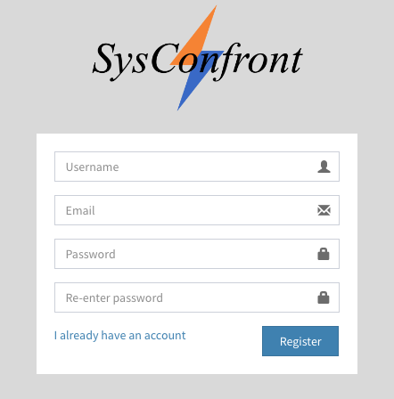

Access https://sysconfront.dinglyu.cn/login/ (or click the 'I already have an account' button). Log in to the platform with the username and password below:

### 2 Build a network

Once login the platform, users can access the network construction page:

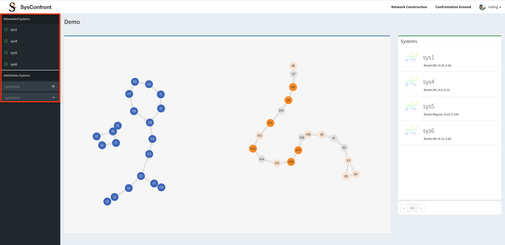

Users can manage their networked systems by adding or deleting networks, as shown in the red box. 
The main panel with a blue top line visualizes two networks with different colors (steel blue and orange).
The right panel with a green top line lists fundamental information about networks, including network model, number of nodes, and edges.
Users click the green circle entitled hyperlink in the red box to build and update the network. 

The network construction has two procedures: adding nodes and adding links. 
First, users can generate a number (N) of nodes with three intrinsic attributes (attack, defense, and health).
N nodes are added to the empty main panel when users submit N, ackmin, ackmax, defmin, defmax, hpmin, and hpmax.
The value of each node attribute follows the uniform distribution from the minimum to the maximum. 
If users resubmit the form (yellow box), existing nodes will be removed and some new nodes will be added.

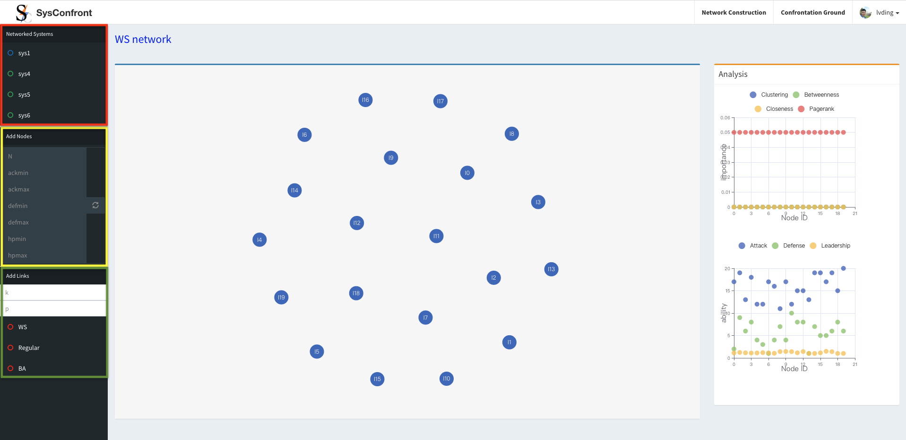

Next, users need to add links between nodes based on some classic network models, including WS small-world model and BA scale-free model.
For example, users build a WS small-world network when submitting the k and p. 
If users resubmit the form (green box), existing links will be removed and some new links will be added.
The main panel with a blue top line visualizes its network structure.

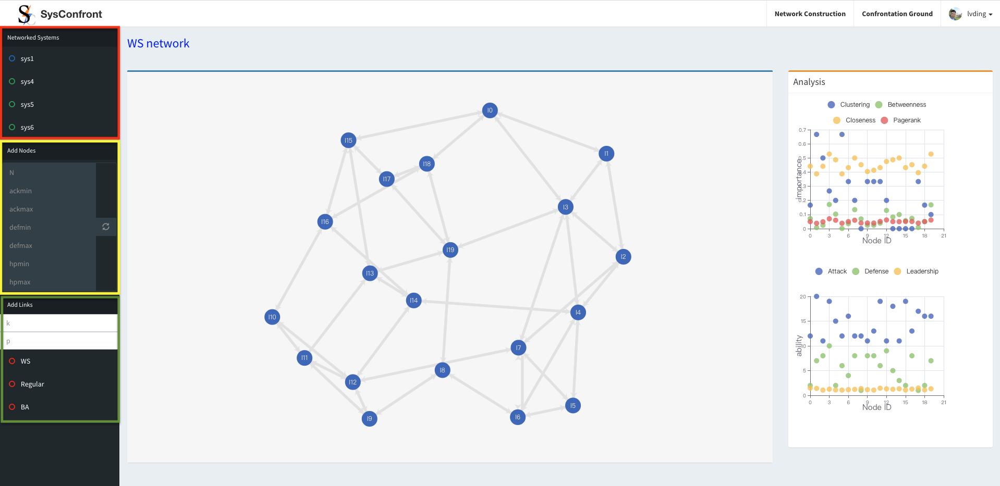

The right panel presents the statistics of node attributes and structural characteristics, such as degree, clustering coefficient,

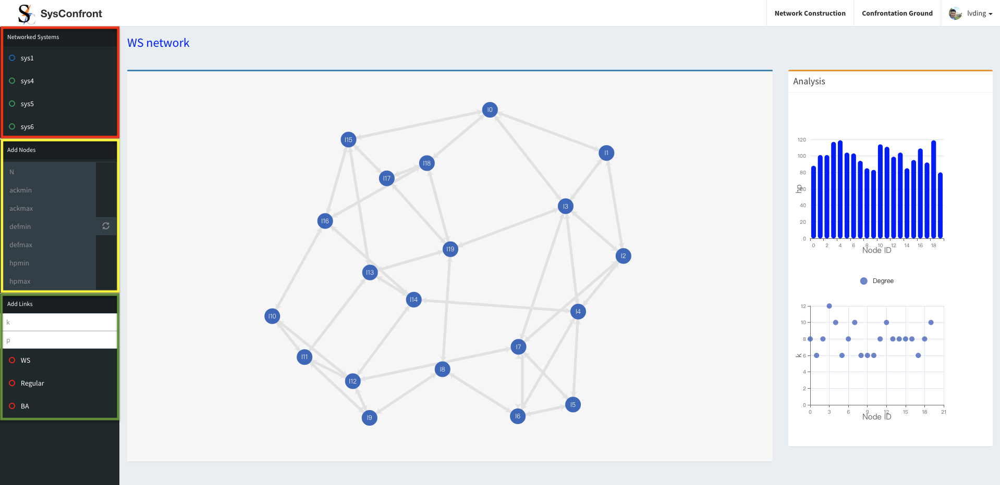

<b><i>If users resubmit the yellow-box form, existing nodes and their links are removed, and new nodes are then added.</i></b>

### Set up a confrontation game of two networks
By clicking the 'confrontation ground' hyperlink in the navbar, users can access the network confrontation page, as shown below:

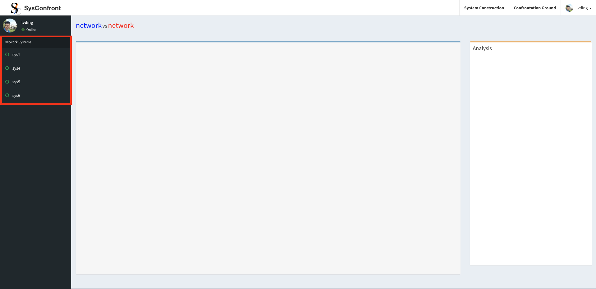

Click the green circle entitled hyperlink in the red box to access the corresponding network's confrontation game. 
<b><i>Note that the platform will report an error if there is no node or edge in the network (empty network or only nodes).</i></b>
The main panel with a blue top line visualizes its structure.

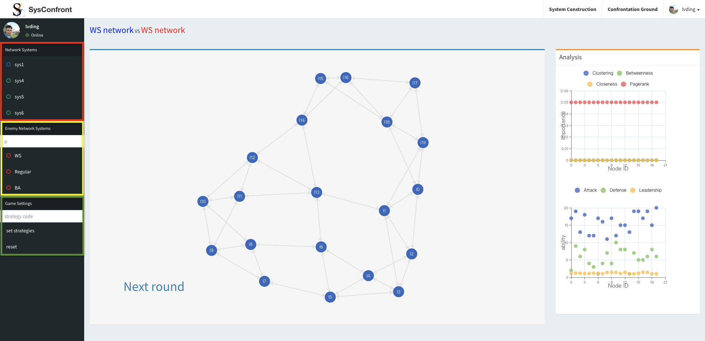

Before a confrontation game, users need to add an adversarial network by submitting the yellow-box form.
The adversarial network (orange) has the same number of nodes and attributes as the custom network (blue).
Besides, the number of edges is also the same if the network models are the same.
The right panel with an orange top line presents the information about the adversarial network.

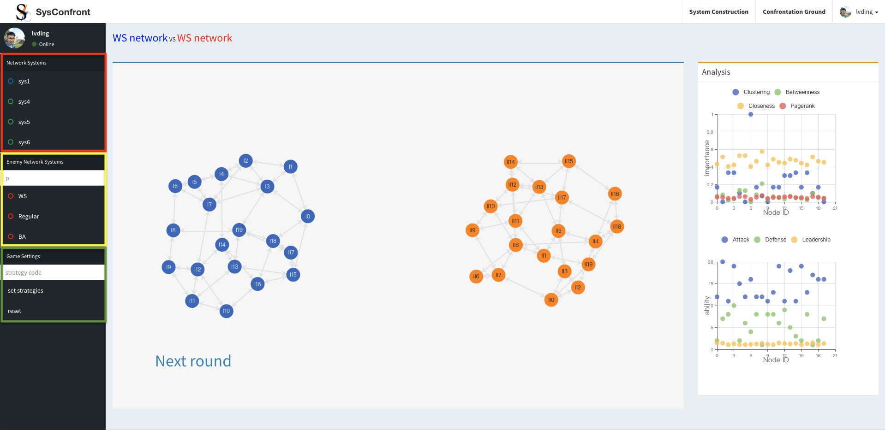

In the confrontation game, users need to set the confrontation strategies of both networks. 
The confrontation strategies proposed in the paper are all embedded into the platform.
Users can switch confrontation strategies by submitting the strategy code in the green-box form.
The strategy code is two-letter or two-number encoding, which is listed below. 
The former letter (or number) corresponds to the custom network' strategy. The latter corresponds to the adversarial network's strategy.
The strategy code is default 'aa' when setting a confrontation game. 

    <table>
        <tr>
            <td><b>Class</b></td>
            <td><b>Code</b></td>
            <td><b>Strategy</b></td>
        </tr>
        <tr>
            <th rowspan="8">No-coop confrontation strategies</th>
            <td>1</td>
            <td>low_<i>def</i>_first</td>
        </tr>
        <tr>
            <td>2</td>
            <td>low_<i>ack</i>_first</td>
        </tr>
        <tr>
            <td>3</td>
            <td>high_<i>def</i>_first</td>
        </tr>
        <tr>
            <td>4</td>
            <td>high_<i>ack</i>_first</td>
        </tr>
        <tr>
            <td>5</td>
            <td>low_<i>ack</i>_low_<i>def</i>_first</td>
        </tr>
        <tr>
            <td>6</td>
            <td>low_<i>ack</i>_high_<i>def</i>_first</td>
        </tr>
        <tr>
            <td>7</td>
            <td>high_<i>ack</i>_low_<i>def</i>_first</td>
        </tr>
        <tr>
            <td>8</td>
            <td>high_<i>ack</i>_high_<i>def</i>_first</td>
        </tr>
        <tr>
            <th rowspan="5">Cooperative confrontation strategies</th>
            <td>a</td>
            <td>cooperative_attacking</td>
        </tr>
        <tr>
            <td>b</td>
            <td>cooperative_attacking_degree</td>
        </tr>
        <tr>
            <td>c</td>
            <td>cooperative_attacking_clustering</td>
        </tr>
        <tr>
            <td>d</td>
            <td>cooperative_attacking_betweenness</td>
        </tr>
        <tr>
            <td>e</td>
            <td>cooperative_attacking_closeness</td>
        </tr>
    </table>  

Users click the 'Next round' button to compute both sides' attack or cooperation orders according to their confrontation strategies.
The orders are visualized in the main panel.

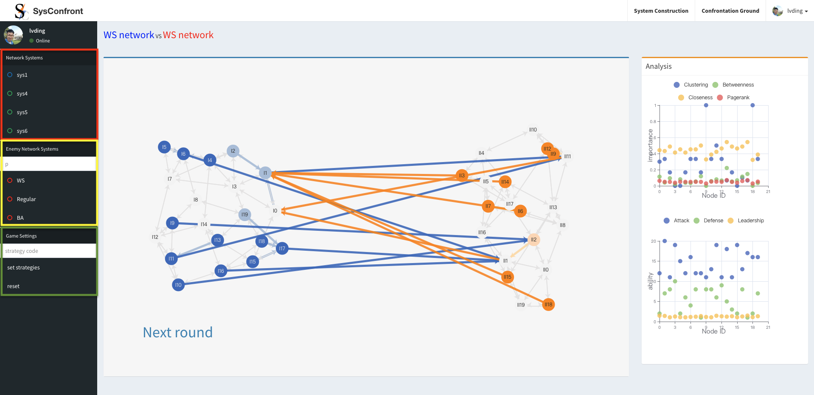
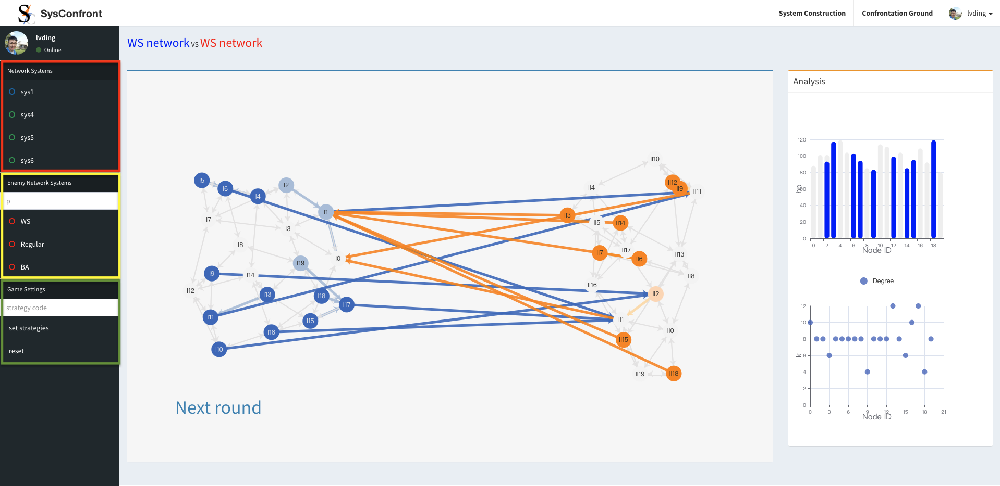

Once all the nodes of one network are eliminated, the other network wins the game. The <i>hp</i> of G2 is zero.

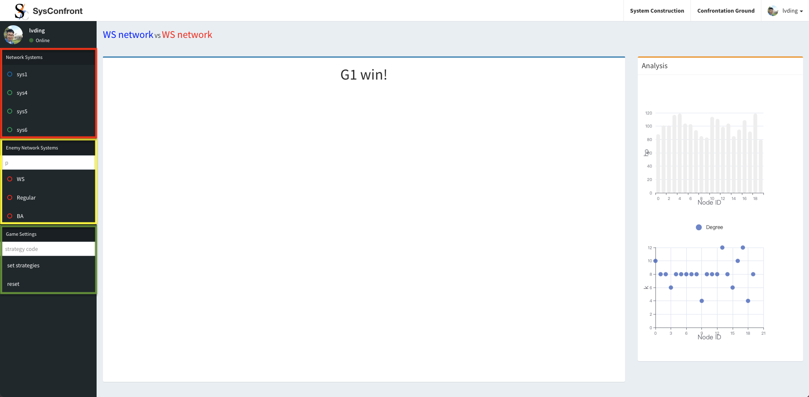

<b><i>
Note that users can switch the confrontation strategies at the end of one round or at the beginning of the confrontation game.
</i></b>

### Profile
Users can check their personal information on the profile page, as shown below:

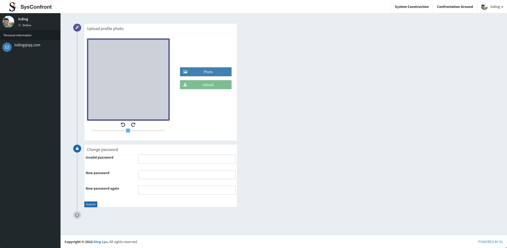

